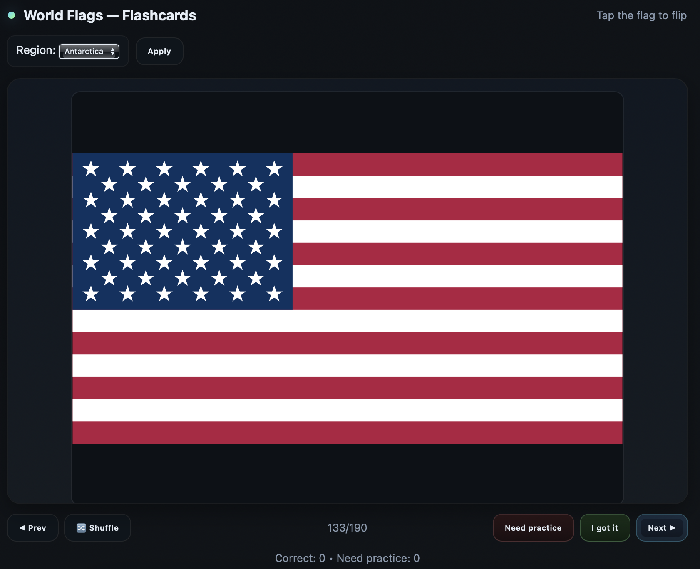

# 🌍 FlashFlags - World Flags Flashcards

Web app to study vexillology and memorize the flags of the world.

Open `index.html` in your browser — no setup required —  or visit http://flashflags.com

  

- **Flip cards** to reveal the country name.

- **Filter by region** (Africa, Americas, Asia, Europe, Oceania) or view all.

- Track progress with **Correct** and **Need Practice** counts.
